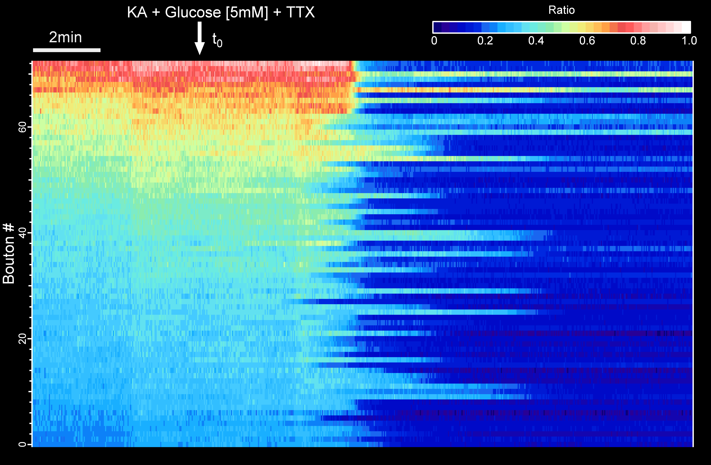
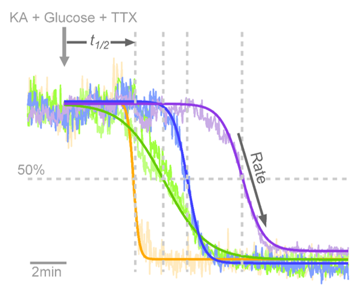

##  Data Collection, Analysis and Visialization of Energy signals in Neuronal Synapses.
Author: Camila Pulido. PhD.

## I. Image processing: Extract and organize fluorescent signal from individuals boutons from a neuron

This protocol delineates the analysis of ATP dynamics within synaptic boutons, employing the last generation of the genetically engineered ATP biosensors, called iATPSnFR2, as detailed in a recent [publication](https://www.biorxiv.org/content/10.1101/2023.08.24.554624v1)

This protocol is intended to use two analysis programs: [ImageJ (Fiji)](https://fiji.sc/) and [IGOR Pro (wavemetrics)](https://www.wavemetrics.com/).

iATPSnFR2 is a variant of iATPSnFR1, a previously developed sensor that has circularly permuted super-folder GFP inserted between the ATP-binding helices of the ε-subunit of a bacterial F0-F1 ATPase. A chimeric version of this sensor fused to either the HaloTag protein or a suitably spectrally separated fluorescent protein, provides a ratiometric readout allowing comparisons of ATP across cellular regions. To capture the ATP signal accurately, the protocol necessitates the use of two separate wavelength lasers —one for the iATPSnFR2 signal and another for the tag protein. This dual-laser approach corrects the signal over sensor expression, enabling precise comparisons between synaptic boutons and across neurons.

Live-imaging acquisition is programed to alternate laser wavelength signals between consecutive camera frames, as depicted below:

The initial step towards simplifying information extraction involves reformatting the videos by splitting them into their respective channels. This can be achieved effortlessly using the following code, with the user only needing to input pertinent information from the experiment settings.

https://github.com/camilapulido/Neuron-Energy-Measurements/blob/52015720e7617088bcca09bbec890cd816269deb/Code/ATPSnFr_Formating.py#L7-L11

Utilize the ['Time Series Analyzer'](https://imagej.net/ij/plugins/time-series.html) Plugin to choose ROIs corresponding to synaptic boutons and effortlessly extract signal information for all experimental conditions, by simply executing the ['Extracting Boutons signal code'](Code/Syn-iATPsf-HALO_Switcher.py), ensuring to save the selected ROIs for future reference (one of the steps in the code).

Draw ROIS corresponding to the background of neurons, and execute the [Background code](Code/Syn-iATPsf-HALO_NoStim_BLACK.py) to automatically get and save data signal.

Import the signal information from all boutons, along with their corresponding background signals, into the IGOR-PRO program (wavemetrics), organizing them into matrix arrays for further analysis.

https://github.com/camilapulido/Neuron-Energy-Measurements/blob/4542016bde86354657417ed060379e6ccbe7fe08/Code/IGOR_ATPSnFR2%20signal%20Analysis.ipf#L6

Correct synaptic boutons signals by subtracting background noise:

https://github.com/camilapulido/Neuron-Energy-Measurements/blob/63ba863a9252eb28478aae6ce3137792bfc30dc3/Code/IGOR_ATPSnFR2%20signal%20Analysis.ipf#L73

At this point, the data is organized and prepared for analysis!

## II. Some analytics of ATP dynamics at Synaptic bouton level:

The human brain, an exceedingly delicate and resource-intensive organ, relies on the constant synthesis of energy molecules, specifically adenosine triphosphate (ATP), to sustain its activities and ensure the proper functioning and maintenance of neurons. Striking a precise balance between ATP synthesis and consumption is imperative to prevent any form of brain dysfunction that may lead to neuronal degeneration. 

The precise energy balance is achieved when neurons have sustained access to a fuel source to facilitate ongoing ATP synthesis. Glucose serves as the primary fuel for neurons and other cells, undergoing enzymatic conversion in a pathway known as ['Glycolysis'](https://en.wikipedia.org/wiki/Glycolysis). In this process, glucose molecules break down into pyruvate, generating ATP along the way. However, disruptions in Glycolysis, whether caused by the malfunction of key enzymes or the removal of the fuel source, promptly hinder the production of new ATP within synaptic boutons. Consequently, the local reserve is rapidly depleted, leading to a cessation of neuronal function. This intricate interplay between energy synthesis and utilization underscores the critical importance of maintaining a delicate equilibrium to safeguard the intricate workings of the human brain.

The subsequent plot illustrates the impact on synaptic boutons ATP levels when synthesis is rapidly inhibited by the introduction of Konigic Acid (KA), a selective drug that targets the activity of [Phosphoglycerate kinase](https://en.wikipedia.org/wiki/Phosphoglycerate_kinase), a pivotal glycolytic enzyme:

The visualization of individual bouton ratio signals in a XYplot accentuates the kinetics of ATP depletion, providing a clearer depiction: 

At the single bouton level, ATP signals declined very rapidly (typically showing depletion within ~ 10-20 sec) but only after a delay time that varied significantly across boutons. Individual bouton ATP levels under these conditions were best described by a simple Boltzmann function from the time that koningic acid was administered, as follows: 

Where t1/2 is the t value where Y is at (base + max)/2, and a represents the rate of signal drop derived from:

[Execute function](https://github.com/camilapulido/Neuron-Energy-Measurements/blob/cdeef732a4266d3b09e8294695a45acc847ba25c/Code/IGOR_ATPSnFR2%20signal%20Analysis.ipf#L239) to to get idividual sigmoidal fits. Visualization plot:

Normalization of representative traces illustrate that individual boutons have unique half-times (t½) to ATP depletion and unique rates of ATP consumption, as: 

A correlation analysis of the two extracted parameters showed that in general smaller t½ were associated with higher alpha values and vice-versa. Some cells showed tighter clustering of rate and t½ parameters than others (Each dot represent a bouton, same population color represent boutons coming from the same neuron): 

Rate values can be visualized in association with synaptic boutons localization: 

Same with t½ values:

Here is reported that iATPSnFR2 can provide detailed measurements of the variations in resting ATP values across synapses as well as the kinetics of ATP changes during metabolic perturbations at single synapse level. These data show for the first time that individual synapses behave as semi-independent metabolic units, as during metabolic stress, the kinetics of ATP depletion varied significantly even within the same axon.  
